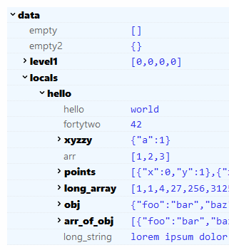
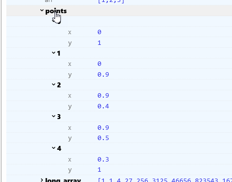

# state-spy

Small widget to display the data property of a page.

## Usage

```html
<script>
    import {StateSpy} from 'state-spy';
    let {
        data  // where data might contain event.locals etc.
    } = $props();
</script>
<StateSpy data />
```

Small objects are initially collapsed, and all collapsed items display their JSON representation:


You can toss in other data as well:

```html
<StateSpy data={[data, {my: "dict"}]}>
```

Maxium width and positioning can be set with:
    
```html
<StateSpy 
    --maxwidth="60vw"
    position="bottom-right"
    data={data} />
```

You can set the number of levels to expand with `show` - yes, I'm aware that it can't count correctly :):

```html

<StateSpy 
    show={2}
    data={data} />
```



Right-clicking on a collapsible will collapse all of its children, i.e. from:



to


(if you right-click enough times, twice, it will also open the children - this is a bug).


---
**packaging:**
    
```bash
npm version patch
npx svelte-package
npm publish
```

**development** (npm works great here, yarn/pnpm not so much).

From this package:

```bash
./state-spy> npm install
./state-spy> rm -rf dist && npx svelte-package
./state-spy> npm link
```

From the package using it:

```bash
./my-app> npm link state-spy
```

Then you can use it in your app as if it were a regular npm package.

**Edit cycle:**

1. stop my-app
2. edit state-spy
3. `rm -rf dist && npx svelte-package`
4. start my-app
5. repeat
